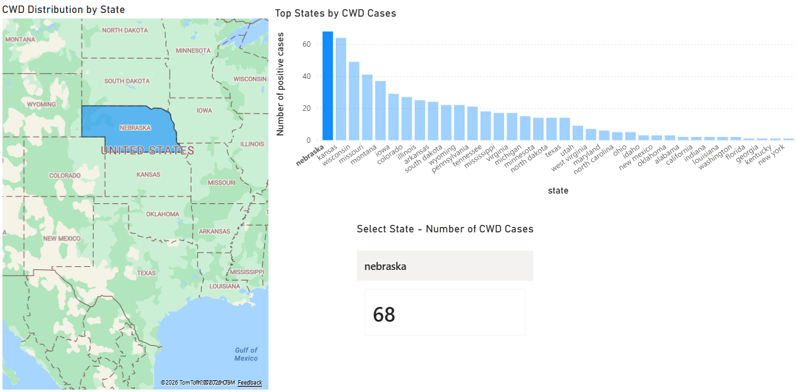
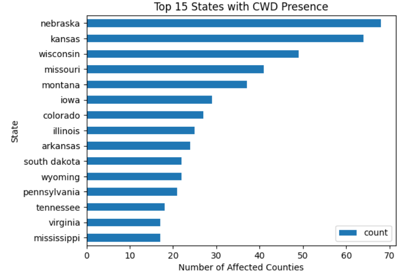

## Data Analytics Portfolio Project | Power BI | Spatial Analysis

# US Chronic Wasting Disease (CWD) Exploratory Spatial Analysis in Wild and Captive Cervid Populations Across U.S. States

## Overview
This project analyzes the geographic distribution of Chronic Wasting Disease (CWD) in wild and captive cervid populations across U.S. states using Power BI.

## Objectives
- Identify states with the highest number of affected counties;
- Visualize counts of disease per state; 
- Build an interactive dashboard for exploration;

## Tools Used
- Python via Google Colab
- Power BI

## Data Source
U.S. Geological Survey (USGS) – CWD distribution in the US by state and county (ver. 3.0, June 2025).

## Key Features
- Interactive map showing disease distribution by state in wild and captive cervid populations;
- Bar chart ranking states by number of affected counties;
- Dynamic filtering using slicers.

## Key Insights
- Midwestern states show the highest concentration of CWD cases;
- CWD is more common in specific regions rather than evenly distributed across states.
- Wild CWD cases significantly exceed captive cases across most states, indicating broader environmental transmission and spread among free-ranging populations.

## Dashboard Preview

*Figure 1. Interactive Power BI dashboard showing CWD distribution across U.S. states.*

## Key Visualization

*Figure 2. Top 15 U.S. states ranked by number of CWD-affected counties.*

## How to Reproduce
1. Load dataset into Python / SQL;
2. Aggregate by state;
3. Export to CSV;
4. Build visuals in Power BI.

## Author
Maria Julia Judson
