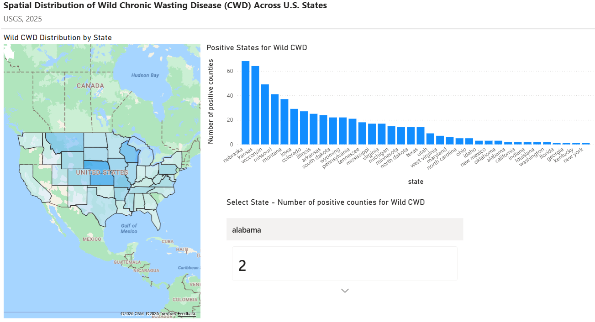
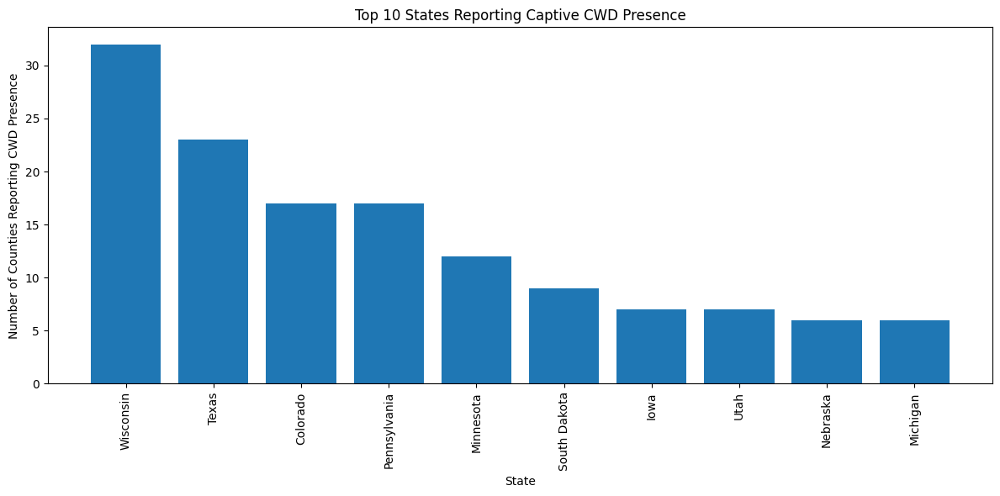
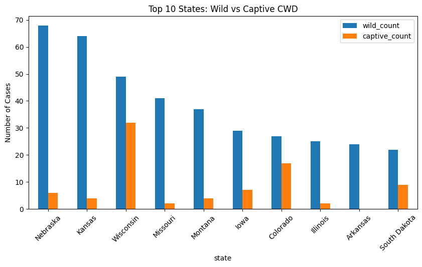

## Data Analytics Portfolio Project | Power BI | Spatial Analysis

# US Chronic Wasting Disease (CWD) - Exploratory Data Analysis/Wild and Captive Positive Cervid Population Distribution

## Overview
This project explores the geographic distribution of Chronic Wasting Disease (CWD) in both wild and captive cervid populations across the United States.
Using Python for data processing and Power BI for visualization, the analysis highlights spatial patterns, state-level differences, and contrasts between wild and captive disease presence.

## Objectives
- Identify states with the highest number of CWD-affected counties;
- Compare disease distribution between wild and captive populations;
- Develop an interactive dashboard for exploratory analysis.

## Tools Used
- Python (Jupyter Notebook / Colab) – data cleaning and transformation;
- Power BI – interactive dashboard and visualizations.

## Data Source
U.S. Geological Survey (USGS) – CWD distribution in the US by state and county (ver. 3.0, June 2025).

## Key Features
- Bar charts ranking states by number of affected counties;
- Interactive map showing disease distribution by state in wild cervid populations;
- Dynamic filtering using slicers (number of affected counties by state);

## Dashboard Preview

*Figure 1. Interactive Power BI dashboard showing wild CWD distribution across U.S. states.*

## Key Visualization

*Figure 2. Top 10 US States reporting captive CWD presence, in decreasing order.*

## Additional Visualization

*Figure 3. Spatial distribution of wild and captive CWD cases across U.S. states, highlighting differences in geographic spread between populations.*

## Key Insights
- CWD cases are highly concentrated in Midwestern states, indicating regional clustering rather than uniform national distribution.
- The disease shows clear geographic patterns, suggesting environmental and ecological factors may influence its spread.
- Wild cervid populations consistently show higher case counts than captive populations across most states.
- The broader distribution of wild cases suggests more extensive transmission dynamics in free-ranging populations compared to localized captive settings.

## Analysis Highlights

This analysis highlights the importance of monitoring wild populations to better understand and manage the spread of CWD.

## Analytical Approach
- Data cleaning and preprocessing in Python;
- Aggregation at the state level (number of affected counties);
- Integration of wild and captive datasets;
- Comparative analysis between populations;
- Development of interactive visualizations in Power BI.

## Author
Dr. Maria Julia Judson, DVM, MSC.
